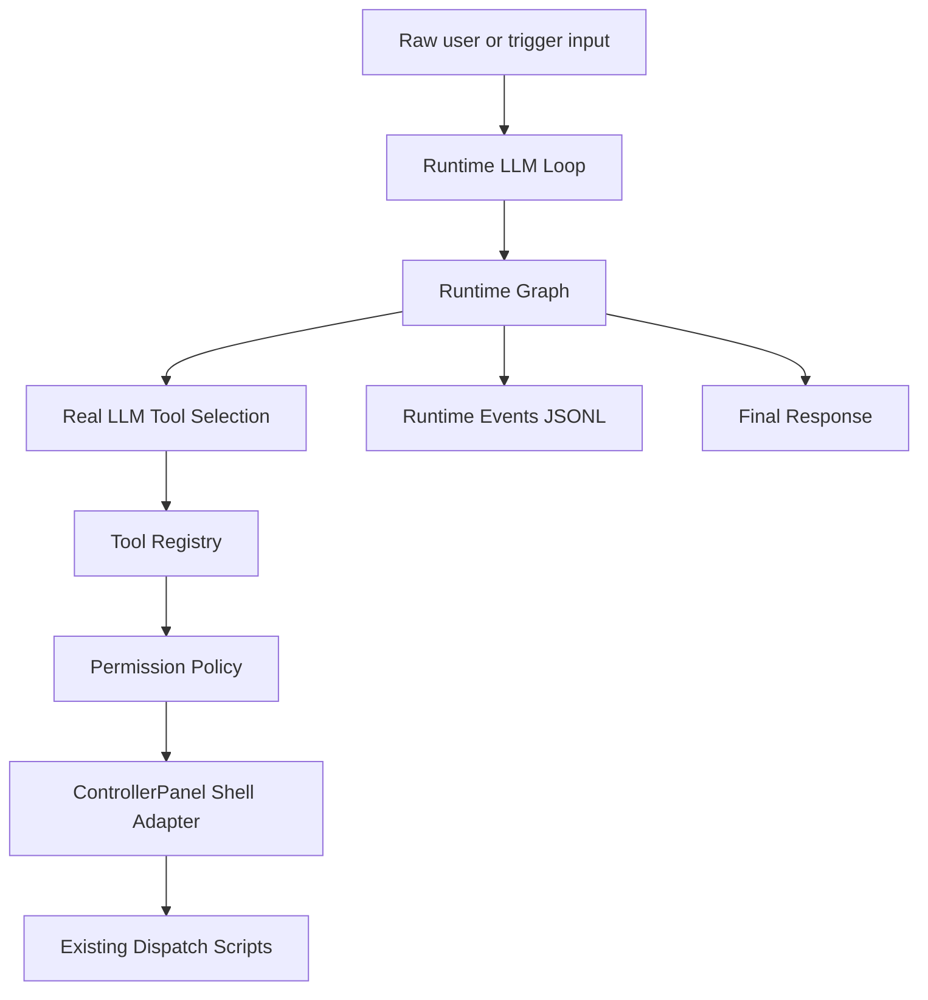

# Runtime

`src/runtime` is the **always-on LLM Loop layer** for CreatorMesh.

It receives raw human or trigger input, uses a real LLM API to understand intent and select ControllerPanel tools, enforces permission policy, executes allowed tools, records runtime events, and returns a user-facing response.

---

## Architecture



---

## Modules

| Directory | Responsibility |
|-----------|---------------|
| `loop/` | Entry point. `runRuntimeTurn` receives raw input, invokes the graph, writes events, returns result. |
| `graph/` | LangGraph-based state machine. Nodes: LLM decide → permission check → execute tool → respond. |
| `llm/` | LangChain + Anthropic LLM client. Reads `ANTHROPIC_API_KEY` / `CREATORMESH_RUNTIME_MODEL`. Structured output for tool selection. |
| `tools/` | `RuntimeTool` interface and registry for the four ControllerPanel tools. |
| `adapters/` | Shell adapter wrapping `scripts/dispatch/*.sh` via `child_process.execFile`. |
| `policies/` | Permission policy. Read tools auto-allowed; `create_claude_task` requires human approval. |
| `events/` | `RuntimeEvent` type and JSONL writer to `~/creator-mesh-runtime/runtime-events/`. |

---

## Environment Variables

| Variable | Required | Default | Purpose |
|----------|----------|---------|---------|
| `ANTHROPIC_API_KEY` | Yes | — | Anthropic API key |
| `CREATORMESH_RUNTIME_MODEL` | No | `claude-haiku-4-5-20251001` | Claude model to use |
| `CREATORMESH_EVENTS_DIR` | No | `~/creator-mesh-runtime/runtime-events` | Events JSONL output dir |
| `CREATORMESH_RUNTIME_DIR` | No | `~/creator-mesh-runtime` | Runtime state base dir |

---

## Execution Loop (one turn)

```
1. receive raw user input
2. record input_received event
3. load model config (fail fast if ANTHROPIC_API_KEY missing)
4. call real LLM → RuntimeToolDecision (intent + tool + args + confidence)
5. check permission policy
   → allowed: execute tool
   → needs_approval: return without executing
   → denied/none: return blocked message
6. record all events to JSONL
7. return RuntimeTurnResult
```

---

## ControllerPanel Tools

| Tool | Permission | Wraps |
|------|-----------|-------|
| `list_projects` | auto-allowed | reads `~/creator-mesh-runtime/config/projects.yaml` |
| `list_runs` | auto-allowed | `scripts/dispatch/list_runs.sh` |
| `check_run_status` | auto-allowed | `scripts/dispatch/check_run_status.sh` |
| `create_claude_task` | **needs_approval** | `scripts/dispatch/create_claude_task.sh` |

---

## Key Design Principles

- **Workflows are not invented upfront.** They are extracted later from repeated successful runtime traces.
- **Agents are not the starting point.** They emerge later as stable roles after tools, workflows, and review patterns become clear.
- **Knowledge is not an upfront RAG layer.** It is distilled later from completed runs, human reviews, and repeated workflows.
- **Runtime starts as a real LLM Loop**, not a fixed workflow engine.

---

## Future Capabilities (not yet implemented)

- Runtime session manager and context builder
- Checkpointing and pause/resume via LangGraph
- Visualization of runtime event traces
- Workflow extraction from repeated traces
- Multi-agent orchestration
- Human-in-the-loop approval flow (interactive)
- Knowledge distillation from completed runs
- Cross-surface continuity (CLI, Telegram, Web Console)

---

## Pre-existing `runtime.ts`

`runtime.ts` at the module root predates this LLM Loop addition. It is the `StepExecutor` implementation used by `LocalWorkflowRunner` for structured workflow step dispatch. It is preserved unchanged. The new LLM Loop (`loop/`, `graph/`) is additive and does not replace it.
